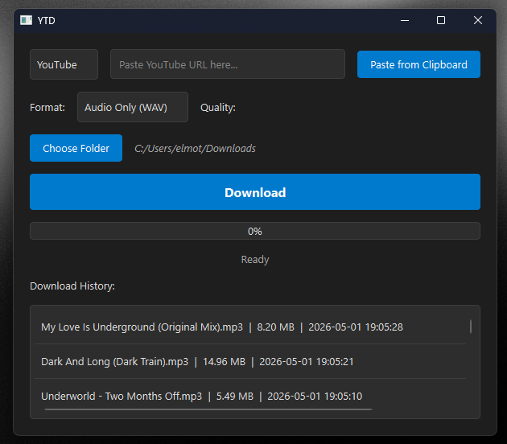

# YTD - YouTube & Spotify Downloader

A lightweight desktop app for downloading music and videos from YouTube and Spotify. Built with Python and PyQt6.



## Features

- **YouTube Downloads** — Video (MP4), Audio (MP3), or Audio (WAV)
- **Spotify Downloads** — Tracks, albums, and playlists (downloaded as MP3 via YouTube search)
- **Album Art & Metadata** — Spotify downloads are tagged with title, artist, album name, and cover art (ID3 tags)
- **YouTube Thumbnail Embedding** — MP3 downloads from YouTube include the video thumbnail
- **Quality Selection** — Video: Best / 1080p / 720p / 480p | Audio: 320 / 192 / 128 kbps
- **Download History** — Right-click to open file or folder
- **Paste from Clipboard** — One-click URL pasting
- **Dark Theme** — Easy on the eyes
- **No Spotify API Key Required** — Uses native web scraping

## Download

| Platform | Download |
|----------|----------|
| Windows  | [YTD-Windows.exe](https://github.com/ElmoTuisk/YTD/releases/latest) |
| macOS    | [YTD.dmg](https://github.com/ElmoTuisk/YTD/releases/latest) |

> Head to the [Releases](https://github.com/ElmoTuisk/YTD/releases) page and grab the latest build for your platform.

## Run from Source

**Requirements:** Python 3.11+, FFmpeg

```bash
pip install PyQt6 yt-dlp requests mutagen
python main.py
```

Platform-specific source code is in the `windows/` and `macos/` directories.

## Build

### Windows

1. Place `ffmpeg.exe` and `ffprobe.exe` in the `windows/` directory
2. Run:
```bash
cd windows
pyinstaller main.spec
```

### macOS

```bash
cd macos
chmod +x build_mac.sh
./build_mac.sh
```

## Tech Stack

- **GUI:** PyQt6
- **Downloader:** yt-dlp
- **Audio Processing:** FFmpeg (bundled)
- **Spotify Integration:** Pathfinder GraphQL API (reverse-engineered)
- **Metadata:** mutagen (ID3 tag embedding)

## License

This project is provided as-is for personal use.
